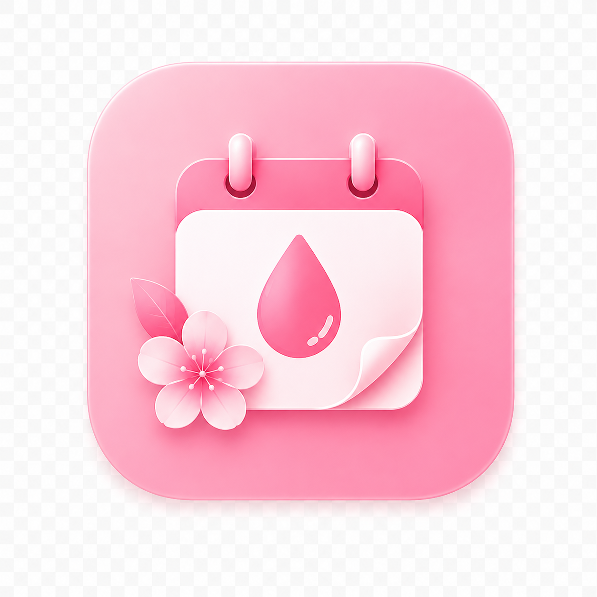
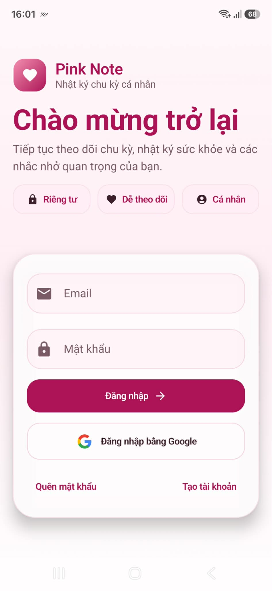
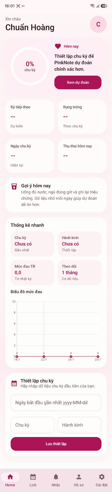

# Pink Note

Pink Note là ứng dụng Android hỗ trợ theo dõi chu kỳ kinh nguyệt và chăm sóc sức khỏe cá nhân. Ứng dụng hướng đến trải nghiệm nhẹ nhàng, riêng tư và dễ sử dụng, giúp người dùng ghi nhận dữ liệu hằng ngày, theo dõi lịch chu kỳ, xem dự đoán và nhận các gợi ý phù hợp theo từng giai đoạn.

  

## Mục Tiêu Dự Án

Pink Note được xây dựng để giúp người dùng:

- Theo dõi ngày bắt đầu và kết thúc kỳ kinh.
- Dự đoán kỳ kinh tiếp theo, ngày rụng trứng và khoảng dễ mang thai.
- Ghi lại nhật ký sức khỏe hằng ngày như mức đau, tâm trạng, nhiệt độ, cân nặng, triệu chứng và ghi chú cá nhân.
- Xem thống kê nhanh về chu kỳ, hành kinh, mức đau và thời gian theo dõi.
- Nhận nhắc nhở cho kỳ kinh, ngày rụng trứng, uống thuốc, uống nước và các hoạt động cá nhân.
- Quản lý hồ sơ sức khỏe, cài đặt ứng dụng và phân quyền quản trị.

## Giao Diện Ứng Dụng

  
  

## Chức Năng Chính

- Đăng ký, đăng nhập bằng Email hoặc Google.
- Hồ sơ người dùng với thông tin cá nhân và mục tiêu sức khỏe.
- Thiết lập chu kỳ linh hoạt, có thể chỉnh sửa bất cứ lúc nào.
- Home hiển thị countdown, tiến trình chu kỳ, gợi ý hôm nay và thống kê nhanh.
- Calendar View hiển thị ngày hành kinh, ngày rụng trứng, khoảng dễ mang thai và nhật ký từng ngày.
- Daily Log cho từng ngày với triệu chứng, tâm trạng, mức đau và ghi chú.
- Reminder cho các nhắc nhở sức khỏe.
- Setting với chế độ sáng/tối, thông báo, đổi mật khẩu, đăng xuất và xóa tài khoản.
- Admin Console để quản lý người dùng và phân quyền `user/admin`.

## Công Nghệ

Pink Note được phát triển bằng Kotlin theo hướng MVVM, Clean Architecture và Repository Pattern. Ứng dụng sử dụng Jetpack Compose, Material Design 3, Hilt, Kotlin Coroutines, Flow/StateFlow, Room, WorkManager, DataStore, Firebase Authentication, Cloud Firestore, Firebase Cloud Messaging và MPAndroidChart.

## Trải Nghiệm

Ứng dụng dùng tông hồng pastel, nền sáng nhẹ và các thành phần trực quan phù hợp với sản phẩm chăm sóc sức khỏe. Bottom Navigation giúp người dùng di chuyển nhanh giữa Home, Lịch, Nhắc nhở, Hồ sơ và Cài đặt.

Pink Note ưu tiên bố cục rõ ràng, trạng thái rỗng dễ hiểu, dữ liệu dễ đọc và tương tác đơn giản để người dùng có thể ghi nhận sức khỏe cá nhân mỗi ngày một cách thoải mái.
